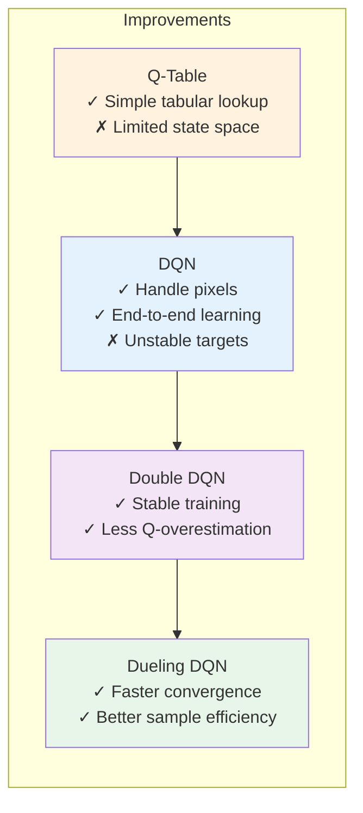
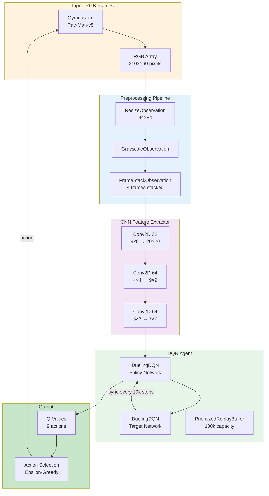

# Dr. Pac-Man: Deep Q-Learning Agent

<p align="center">
  
  
  
</p>

## Overview

This project uses Machine Learning to beat Pac-Man. The agent learns by playing thousands of games, gradually improving its strategy through experience.

### How It Works

**1. Vision (CNN)**
- The game sends raw pixel frames (RGB arrays) from Gymnasium
- A Convolutional Neural Network (CNN) extracts features from these images
- The CNN learns to recognize patterns: ghost positions, pellet locations, corridors

**2. Decision Making (DQN)**
- The network outputs Q-values representing "how good is each action in this situation"
- Actions: up, down, left, right, or wait (9 total)
- Higher Q-value = better expected long-term reward

**3. Learning (Reinforcement Learning)**
- The agent learns from a **Reward Wrapper** that modifies base game rewards:

| Event | Base Reward | Shaped Reward | Purpose |
|-------|-------------|---------------|---------|
| Eat pellet | 10 | **+5.0** | 5x boost to encourage pellet-seeking |
| Eat power pellet | 50 | **+25.0** | Big bonus for ghost hunting |
| Eat ghost | 200-1600 | **+100-800** | Massive reward for risky plays |
| Death | -1 | **-5.0** | Recoverable penalty |
| No action (idle) | 0 | **-0.001/step** | Penalty for standing still |

The reward wrapper makes rewards **5x more appealing** than the original game, so eating just 1 pellet (+5) fully recovers from a death (-5). The idle penalty (-0.001/step) prevents the agent from standing still indefinitely.

### Reward Philosophy

- **Death is recoverable**: A single pellet (+5) offsets one death (-5)
- **Pellets are valuable**: Encourage path efficiency and maze navigation
- **Idle is punished**: Even -0.001/step adds up over time, pushing the agent to move
- **Ghosts are high-risk, high-reward**: Massive points but requires positioning

## Evolution Timeline

The project evolved through four major stages of RL sophistication, from simple tabular learning to deep neural networks:

```mermaid
flowchart LR
    subgraph Stage1 [Stage 1: Q-Table]
        direction TB
        Q1[State-Action<br/>Lookup Table]
        Q2[9 states × 9 actions<br/>= 81 Q-values]
        Q3[Limitation: Too small<br/>for Atari pixels]
    end

    subgraph Stage2 [Stage 2: DQN]
        direction TB
        D1[Raw Pixels<br/>84×84×4 frames]
        D2[CNN Feature<br/>Extractor]
        D3[Q-Values<br/>9 actions]
        D4[PyTorch Tutorial<br/>reinforcement_q_learning.html]
    end

    subgraph Stage3 [Stage 3: Double DQN]
        direction TB
        T1[Policy Network<br/>selects actions]
        T2[Target Network<br/>evaluates actions]
        T3[Stable Q-targets<br/>Reduced overestimation]
    end

    subgraph Stage4 [Stage 4: Dueling DQN]
        direction TB
        U1[Value Stream V(s)<br/>How good is this state?]
        U2[Advantage Stream A(s,a)<br/>Which action is best?]
        U3[Q = V + A - mean(A)<br/>Better estimates]
    end

    Stage1 --> |"Replace table<br/>with neural net"| Stage2
    Stage2 --> |"Add target<br/>network"| Stage3
    Stage3 --> |"Refactor<br/>architecture"| Stage4

    style Stage1 fill:#fff3e0
    style Stage2 fill:#e3f2fd
    style Stage3 fill:#f3e5f5
    style Stage4 fill:#e8f5e9
```

### Key Improvements by Stage



### Stage 1: Q-Table (Baseline)
**Inspired by:** [roadmap.sh Machine Learning](https://roadmap.sh/machine-learning?fl=0)

Started with a simple tabular Q-learning approach. Limitations:
- State space too large for Atari (84×84×256 possible pixel combinations)
- Could only handle discrete, low-dimensional state spaces
- Not practical for visual game inputs

### Stage 2: DQN (Deep Q-Network)
**Inspired by:** [PyTorch Reinforcement Q-Learning Tutorial](https://docs.pytorch.org/tutorials/intermediate/reinforcement_q_learning.html)

Replaced Q-table with a Convolutional Neural Network (CNN):
- **CNN**: Extracts visual features from raw 84×84 pixel frames
- Learns to recognize Pac-Man, ghosts, pellets, and maze walls
- Replaces simple lookup table with end-to-end learning from pixels to actions
- Experience replay for sample efficiency
- Target network for stable training

### Stage 3: Double DQN (Double Deep Q-Network)

Added a second network (target network) to reduce overestimation:
- Two networks: `policy_net` and `target_net`
- Policy network selects actions, target network evaluates them
- Updates target network periodically (every 10,000 steps)
- Reduces Q-value overestimation bias

### Stage 4: Dueling DQN (Current)

Refactored network architecture for better value estimation:
- Separates value function V(s) from advantage function A(s,a)
- Learns "how good is this state" separately from "which action is best"
- Combines with: Q(s,a) = V(s) + (A(s,a) - mean(A))
- Achieves faster convergence and better performance

## Technical Architecture

### Training Pipeline

```mermaid
flowchart TD
    A[("Gym Environment<br/>Pac-Man-v5")] --> B[RGB Frame<br/>210×160]
    B --> C[Resize 84×84<br/>+ Grayscale<br/>+ Stack 4 frames]
    C --> D[CNN Feature<br/>Extractor]
    D --> E[Shared Features<br/>3136 dim]
    E --> F[Dueling Streams<br/>V(s) + A(s,a)]
    F --> G[Q-Values<br/>9 actions]
    G --> H[ε-Greedy<br/>Action Selection]
    H --> I[Action → Environment<br/>up, down, left, right]
    I --> J[Reward Signal<br/>+5 pellet, -5 death]
    J --> K[Experience<br/>s, a, r, s', done]
    K --> L[Prioritized<br/>Replay Buffer]
    L --> M[Sample Batch<br/>64 experiences]
    M --> N[Double DQN Loss<br/>Update priorities]
    N --> O[Sync Target Net<br/>Every 10k steps]
    O --> D

    style A fill:#fff3e0
    style D fill:#f3e5f5
    style J fill:#c8e6c9
    style L fill:#e8f5e9
```

### Neural Network Architecture

```mermaid
flowchart LR
    subgraph Input
    I[Input: 4×84×84<br/>RGB Game Frames]
    end

    subgraph CNN ["CNN Feature Extractor"]
    I --> C1[Conv2D 32<br/>8×8 stride4<br/>ReLU]
    C1 --> C2[Conv2D 64<br/>4×4 stride2<br/>ReLU]
    C2 --> C3[Conv2D 64<br/>3×3 stride1<br/>ReLU]
    C3 --> F[Flatten<br/>3136 features]
    end

    subgraph Dueling_Streams
    F --> V[V Stream<br/>FC 512 → 1<br/>"How good is state?"]
    F --> A[A Stream<br/>FC 512 → 9<br/>"Which action best?"]
    end

    subgraph Output
    V --> Q[Q-Values<br/>9 actions]
    A --> Q
    end

    style CNN fill:#e3f2fd
    style V fill:#e1f5fe
    style A fill:#fce4ec
    style Q fill:#e8f5e9
```

### Hyperparameters

| Parameter | Value | Description |
|-----------|-------|-------------|
| **Gamma (γ)** | 0.99 | Discount factor for future rewards |
| **Learning Rate** | 2.5e-4 | Adam optimizer learning rate |
| **Batch Size** | 64 | Experiences per training step |
| **Replay Buffer** | 100,000 | Maximum stored experiences |
| **Priority Alpha (α)** | 0.6 | Prioritization exponent |
| **Beta Start** | 0.4 | IS weight exponent (annealed to 1.0) |
| **Beta Frames** | 100,000 | Annealing duration for beta |
| **Epsilon Start** | 1.0 | Initial exploration rate |
| **Epsilon Decay** | 0.99999 | Per-step decay multiplier |
| **Epsilon Min** | 0.01 | Minimum exploration rate |
| **Burn-in** | 5,000 | Pre-learning steps |
| **Learn Every** | 4 | Training frequency |
| **Target Sync** | 10,000 | Target network sync interval |
| **Gradient Clip** | 10.0 | Max gradient norm |

### Feature Summary

| Feature | Benefit | Implementation |
|---------|---------|----------------|
| **Dueling DQN** | Better Q-value estimation | Separate V(s) and A(s,a) streams |
| **Prioritized Replay** | Learn from important experiences | TD-error based sampling |
| **Double DQN** | Stable target values | Policy selects, target evaluates |
| **Beta Annealing** | Reduced bias over time | 0.4 → 1.0 over 100k steps |
| **Custom Rewards** | Better learning signals | Pellet (+5), Ghost (-5), Idle (-0.001) |
| **Auto Checkpoint** | Seamless resume | Finds best checkpoint automatically |
| **Apple Silicon** | GPU acceleration | Full MPS support for M1/M2/M3 |

### System Architecture Overview



## Running Training

The training script `train_single.py` trains the agent using single-process DQN with automatic checkpoint discovery.

```bash
python train_single.py
```

### Training Modes

```python
# Auto-resume (default - finds best checkpoint automatically)
train_single_process(episodes=1000)

# Force fresh start (ignore existing checkpoints)
train_single_process(episodes=1000, checkpoint=False)

# Load specific checkpoint
train_single_process(episodes=1000, checkpoint="saved_models/dqn_episode_500.pth")
```

### Quick Test Run

```python
# For rapid verification
train_single_process(
    episodes=10,
    save_every=5,
    print_every=1
)
```

## Running Evaluation

After training, evaluate the model with `evaluate_agent.py`.

```bash
# Evaluate final model (headless)
python evaluate_agent.py --model saved_models/dqn_final.pth --episodes 10

# Watch the agent play with rendering
python evaluate_agent.py --model saved_models/dqn_final.pth --episodes 5 --render
```

### Compare Checkpoints

```bash
python evaluate_agent.py --model saved_models/dqn_episode_500.pth \
    --compare saved_models/dqn_episode_1000.pth saved_models/dqn_final.pth
```

### Quick Playback

```bash
python -c "from play_agent import PlayAgent; PlayAgent().play('saved_models/dqn_final.pth', 3)"
```

## Project Structure

```
PyCharmMiscProject/
├── train_single.py              # Main training script with auto-discovery
├── rl_agent.py                  # DQN agent with prioritized replay
├── dqn_networks.py              # DQN and Dueling DQN architectures
├── pacman_reward_wrapper.py     # Custom reward shaping
├── evaluate_agent.py            # Model evaluation and comparison
├── play_agent.py                # Simple playback utility
├── saved_models/                # Checkpoint directory (git-ignored)
│   ├── dqn_final.pth           # Final trained model
│   └── dqn_episode_*.pth       # Periodic checkpoints
├── README.md                    # This file
├── AGENTS.md                    # AI agent guidelines
└── CLAUDE.md                    # Claude Code instructions
```

## Tips & Troubleshooting

| Platform | Recommendation |
|----------|----------------|
| **Apple Silicon** | Training automatically uses MPS (Metal) for acceleration |
| **NVIDIA GPU** | Automatically detected and used if CUDA is available |
| **Resume Training** | Just run `python train_single.py` - auto-resumes |
| **Start Fresh** | Use `checkpoint=False` or delete `saved_models/` contents |
| **Checkpoint Files** | All `.pth` files are git-ignored |

## References

- **Starting Point:** [roadmap.sh Machine Learning Projects](https://roadmap.sh/machine-learning?fl=0)
- **DQN Tutorial:** [PyTorch Reinforcement Q-Learning](https://docs.pytorch.org/tutorials/intermediate/reinforcement_q_learning.html)
- **Gymnasium:** [Python RL Environment](https://gymnasium.farama.org/)
- **Paper:** [Dueling DQN: "Dueling Network Architectures for Deep Reinforcement Learning"](https://arxiv.org/abs/1511.06581)
