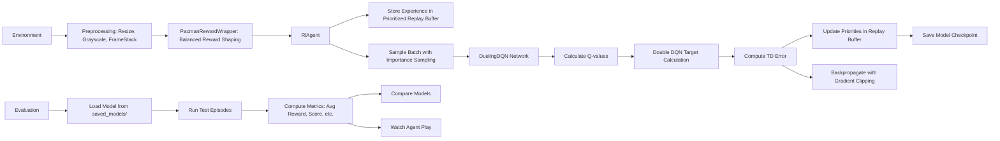

# Pac-Man DQN Reinforcement Learning: Technical Documentation

## Overview

This document provides comprehensive technical documentation for a Deep Q-Network (DQN) implementation targeting the Atari Pac-Man environment. The system implements state-of-the-art reinforcement learning techniques including Dueling DQN architecture, prioritized experience replay, and double Q-learning.

## Training Pipeline Sequence

```mermaid
sequenceDiagram
    participant Train as train_single.py
    participant Agent as RlAgent
    participant Policy as PolicyNet DuelingDQN
    participant Target as TargetNet DuelingDQN
    participant Env as PacmanEnv Wrapped
    participant Buffer as PrioritizedReplayBuffer
    participant Optimizer as Adam Optimizer

    Note over Train,Optimizer: Initialization Phase
    Train->>Env: Initialize environment and wrappers
    Env-->>Train: Return initial state
    Train->>Agent: Create agent with networks
    Agent->>Policy: Initialize DuelingDQN
    Policy-->>Agent: Return initialized network
    Agent->>Target: Copy weights from Policy
    Target-->>Agent: Return initialized target network
    Agent->>Buffer: Create replay buffer
    Buffer-->>Agent: Return buffer instance
    Agent-->>Train: Return initialized agent

    Note over Train,Optimizer: Burn-in Phase
    loop Until 5000 experiences
        Train->>Agent: select_action with explore
        Agent-->>Train: Return random action
        Train->>Env: Execute action
        Env-->>Train: Return next state and reward
        Train->>Buffer: Store experience
    end

    Note over Train,Optimizer: Main Training Loop
    loop For each training step
        Note over Train,Agent: Action Selection Phase
        Train->>Agent: select_action
        Agent->>Agent: Check exploration condition
        alt Explore mode
            Agent-->>Train: Return random action
        else Exploit mode
            Agent->>Policy: forward pass
            Note right of Policy: CNN to Value and Advantage
            Policy-->>Agent: Return Q-values
            Agent->>Agent: Select best action
            Agent-->>Train: Return best action
        end

        Note over Train,Env: Environment Interaction
        Train->>Env: Execute action
        Env->>Env: Apply action in game
        Note right of Env: Apply reward shaping
        Env-->>Train: Return next state and reward

        Note over Train,Buffer: Experience Storage
        Train->>Buffer: Store experience tuple
        Buffer->>Buffer: Add with max priority
        Buffer-->>Train: Confirm stored

        Note over Agent,Optimizer: Learning Phase
        alt Learning step condition met
            Train->>Agent: Call learn method
            Agent->>Buffer: Sample batch
            Note right of Buffer: Priority-based sampling
            Buffer-->>Agent: Return batch and weights

            Note over Agent,Target: Double DQN Forward Pass
            Agent->>Policy: forward on states
            Policy-->>Agent: Return Q current
            Agent->>Policy: forward on next states
            Policy-->>Agent: Return best next actions
            Agent->>Target: forward on next states
            Target-->>Agent: Return Q target

            Note over Agent: Compute loss
            Agent->>Optimizer: zero_grad
            Agent->>Policy: loss.backward
            Note right of Policy: Apply gradient clipping
            Agent->>Optimizer: step
            Optimizer->>Policy: Update weights

            Agent->>Agent: Compute TD errors
            Agent->>Buffer: Update priorities
            Buffer-->>Agent: Confirm updated
        end

        Note over Agent,Target: Periodic Operations
        alt Target sync condition
            Note over Agent: Sync Target Network
            Agent->>Target: Copy weights from Policy
            Target-->>Agent: Confirm synced
        end

        alt Checkpoint condition
            Note over Train: Save Checkpoint
            Train->>Train: Save model state
        end

        Train->>Train: Update exploration rate
    end

    Note over Train,Optimizer: Evaluation Phase
    Train->>Train: Load checkpoint
    loop Test episodes
        Train->>Agent: select_action in test mode
        Agent->>Policy: forward pass
        Policy-->>Agent: Return Q-values
        Agent-->>Train: Return argmax
        Train->>Env: Execute action
        Env-->>Train: Return next state and reward
        Train->>Train: Accumulate metrics
    end
    Train->>Train: Report results
```



## Architecture Components

### 1. Reward Shaping Module

**Module**: `pacman_reward_wrapper.py`

The PacmanRewardWrapper implements custom reward shaping to optimize the training signal for improved agent performance. The reward structure has been calibrated to balance risk-taking behavior with strategic gameplay.

**Reward Modifications**:

| Event | Default Value | Modified Value | Rationale |
|-------|--------------|----------------|-----------|
| Dot consumption | +10.0 | +5.0 | Increased relative value to encourage pellet collection |
| Agent death | -10.0 | -5.0 | Reduced penalty to promote exploration and recovery strategies |
| Time step | 0.0 | -0.001 | Temporal penalty to discourage passive behavior |

**Design Principle**: The reward structure enables agents to recover from death events through subsequent dot collection, mitigating risk-averse behavior patterns while maintaining strategic decision-making incentives.

### 2. Neural Network Architectures

**Module**: `dqn_networks.py`

#### 2.1 Standard DQN Architecture

The baseline DQN implementation utilizes a convolutional neural network (CNN) backbone for visual feature extraction from game frames:

- **Convolutional Layers**:
  - Layer 1: 8×8 kernels, stride=4
  - Layer 2: 4×4 kernels, stride=2
  - Layer 3: 3×3 kernels, stride=1
- **Fully Connected Layers**:
  - Hidden layer: 512 neurons
  - Output layer: N neurons (where N = number of discrete actions)

#### 2.2 Dueling DQN Architecture

The Dueling DQN extends the standard architecture by decomposing the Q-value function into separate value and advantage estimators:

**Mathematical Formulation**:
```
Q(s,a) = V(s) + (A(s,a) - mean(A(s,a)))
```

Where:
- `V(s)`: State-value function representing the expected return from state s
- `A(s,a)`: Advantage function quantifying the relative benefit of action a in state s
- Mean subtraction: Enforces identifiability by centering the advantage estimates at zero

**Architecture Benefits**:
- Reduces overestimation bias in Q-value approximation
- Improves learning efficiency by separating state quality from action preference
- Enhances generalization across similar states with varying optimal actions

### 3. Reinforcement Learning Agent

**Module**: `rl_agent.py`

The RlAgent class implements the core learning algorithms with several advanced techniques for improved sample efficiency and training stability.

#### 3.1 Prioritized Experience Replay

Experience replay buffer that samples transitions based on their temporal-difference (TD) error magnitude:

- **Priority exponent (α)**: 0.6 — Controls the degree of prioritization
- **Importance sampling exponent (β)**: Anneals from 0.4 to 1.0 — Corrects for sampling bias
- **Sampling strategy**: Transitions with higher TD errors receive proportionally higher sampling probability

#### 3.2 Double Deep Q-Network (DDQN)

Reduces overestimation bias through decoupled action selection and evaluation:

- **Policy network**: Selects greedy action based on current state
- **Target network**: Evaluates the selected action
- **Update frequency**: Target network synchronized every 10,000 steps

#### 3.3 Training Stabilization Techniques

**Gradient Clipping**: Maximum L2 norm of 10.0 prevents exploding gradients during backpropagation

**Beta Annealing Schedule**: Linear interpolation from β=0.4 to β=1.0 over 100,000 steps to gradually correct importance sampling bias

**Exploration Strategy**: ε-greedy policy with exponential decay
- Initial epsilon: 1.0 (full exploration)
- Final epsilon: 0.01 (minimal exploration)
- Decay rate: 0.99999 per environment step

**Burn-in Period**: 5,000 random transitions collected before training commences to initialize replay buffer diversity

### 4. Training Pipeline

**Module**: `train_single.py`

The training orchestration module implements a synchronous, single-process training loop with the following operational characteristics:

**Training Cycle**:
1. Experience collection through environment interaction
2. Transition storage in prioritized replay buffer
3. Batch sampling and network optimization
4. Periodic model checkpointing and evaluation

**State Representation**: 4-frame temporal stack of 84×84 grayscale images, providing motion information through frame concatenation

**Checkpoint Management**: Model state persisted every 100 episodes to `saved_models/` directory

**Telemetry**: Continuous tracking of episode rewards, episode lengths, and training loss metrics for performance monitoring

### 5. Evaluation and Visualization Suite

#### 5.1 Agent Evaluation Module

**Module**: `evaluate_agent.py`

Provides comprehensive model assessment capabilities with the following features:

- **Performance Metrics**: Computes average reward, average score, and maximum score across evaluation episodes
- **Model Comparison**: Comparative analysis functionality via `compare_models()` method for benchmarking multiple checkpoints
- **Command-line Interface**: Argparse-based CLI supporting flexible evaluation configurations

#### 5.2 Interactive Visualization Module

**Module**: `play_agent.py`

Enables real-time visualization of trained agent behavior:

- **Rendering**: Human-readable game display for qualitative assessment
- **Model Loading**: Checkpoint restoration from saved PyTorch state dictionaries
- **Episode Playback**: Sequential execution of game episodes with trained policy

## Algorithmic Foundations

This implementation incorporates the following reinforcement learning techniques:

1. **Dueling DQN Architecture**: Value-advantage decomposition for improved state-value estimation and action preference learning
2. **Prioritized Experience Replay**: TD-error-weighted sampling to focus computational resources on high-information transitions
3. **Double Q-Learning**: Decoupled action selection and evaluation to mitigate overestimation in Q-value approximation
4. **Importance Sampling Correction**: Beta annealing schedule to asymptotically correct prioritized sampling bias
5. **Domain-Specific Reward Shaping**: Calibrated reward structure promoting balanced exploration-exploitation trade-offs

## Data Flow



## Hyperparameter Configuration

The training system utilizes the following hyperparameter settings:

| Parameter | Value | Description |
|-----------|-------|-------------|
| **Input Representation** | 84×84×4 grayscale | Four consecutive frames stacked along channel dimension |
| **Network Architecture** | Dueling DQN | CNN feature extractor with value-advantage decomposition |
| **Optimizer** | Adam | Learning rate: 2.5×10⁻⁴, AMSGrad variant enabled |
| **Batch Size** | 64 | Number of transitions sampled per optimization step |
| **Discount Factor (γ)** | 0.99 | Return discounting for temporal credit assignment |
| **Exploration Schedule** | ε ∈ [1.0, 0.01] | Exponential decay rate: 0.99999 per step |
| **Burn-in Period** | 5,000 steps | Random exploration before learning initialization |
| **Learning Frequency** | Every 4 steps | Network optimization interval |
| **Target Network Sync** | Every 10,000 steps | Frequency of target network parameter updates |
| **Beta Annealing** | β: 0.4 → 1.0 | Linear interpolation over 100,000 steps |
| **Gradient Clipping** | max_norm = 10.0 | L2 norm constraint for gradient stabilization |

## Checkpoint Schema

Model checkpoints are serialized as PyTorch state dictionaries with the following structure:

| Field | Type | Description |
|-------|------|-------------|
| `model_state_dict` | OrderedDict | Policy network parameters (weights and biases) |
| `target_state_dict` | OrderedDict | Target network parameters (weights and biases) |
| `optimizer_state_dict` | OrderedDict | Optimizer state including momentum buffers (optional) |
| `exploration_rate` | float | Current epsilon value for ε-greedy policy |
| `curr_step` | int | Total environment steps executed during training |
| `architecture` | str | Network type identifier: `"dueling_dqn"` or `"dqn"` |
| `metadata` | dict | Optional training metrics: episode number, cumulative steps, rolling average reward |

## Implementation Characteristics

This codebase demonstrates several notable design decisions:

1. **Reward Engineering**: The calibrated penalty structure facilitates recovery-oriented behavior, reducing excessive conservatism in agent policies
2. **Architecture Selection**: Dueling network decomposition enhances learning stability through explicit separation of state valuation and action advantages
3. **Evaluation Infrastructure**: Comprehensive tooling for model comparison and qualitative behavior analysis
4. **Algorithmic Completeness**: Integration of established DQN enhancements including prioritized replay and double Q-learning

The implementation represents a production-grade DQN system suitable for Atari domain applications, incorporating contemporary best practices in deep reinforcement learning.

## Command-Line Interface

### Training

```bash
python train_single.py
```

Initiates the training loop. Checkpoint files will be written to `saved_models/` directory at 100-episode intervals.

### Evaluation

**Single Model Assessment**:
```bash
python evaluate_agent.py --model saved_models/apex_final.pth --episodes 10
```

**Visual Rendering**:
```bash
python evaluate_agent.py --model saved_models/apex_final.pth --episodes 3 --render
```

**Comparative Benchmarking**:
```bash
python evaluate_agent.py --compare \
    saved_models/apex_checkpoint_10000.pth \
    saved_models/apex_final.pth \
    --episodes 5
```

## System Requirements

### Required Dependencies

| Package | Purpose |
|---------|---------|
| `gymnasium` | OpenAI Gym interface with Atari environment support |
| `ale-py` | Atari Learning Environment backend |
| `torch` | PyTorch deep learning framework |
| `numpy` | Numerical computation library |

### Optional Dependencies

| Package | Purpose |
|---------|---------|
| `matplotlib` | Visualization and plotting (for custom analysis scripts) |

## Static Analysis Notes

The following Language Server Protocol (LSP) warnings may appear during development but do not affect runtime functionality:

| Warning | Module | Explanation |
|---------|--------|-------------|
| `Cannot assign to attribute "_beta"` | `PrioritizedReplayBuffer` | Type stub incompleteness; attribute exists at runtime |
| `Cannot access attribute "n"` | `gymnasium.spaces.Space` | Incomplete type annotations for Discrete action space |
| `Operator "*" not supported` | `pacman_reward_wrapper.py` | Type inference limitation with `SupportsFloat` protocol |

These warnings originate from incomplete type stub definitions in third-party libraries and do not indicate actual code defects. All flagged operations execute correctly during runtime.

## Future Enhancements

The following extensions would further improve the system's capabilities:

1. **Training Visualization**: Integration of reward curve plotting and loss trajectory analysis
2. **Web-Based Dashboard**: Browser interface for interactive model comparison and performance visualization
3. **TensorBoard Integration**: Real-time training metric logging for enhanced observability
4. **Automated Benchmarking**: Systematic evaluation pipeline for model checkpoint comparison
5. **Model Compression**: Knowledge distillation techniques to produce lightweight inference models with preserved performance
